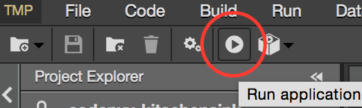
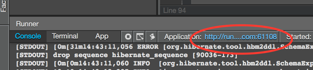

codenvy-cloud-ide
=================
Author: Thomas Qvarnström, tqvarnst@redhat.com  
Level: Beginner  
Technologies: Cloud IDE, Java EE   
Summary: In collaboration with Codenvy we have created demos for running JBoss development using their cloud based IDE developement environment. Codenvy provided us with additional memory for our demos so that we can run JBoss software. Codenvy also provides developers with runners so that developers can deploy their code. We have provided a couple of demos using the Clodenvy platform with Red Hat software.   
Prerequisites: None  
Target Product: WildFly  
Product Versions: WildFly 8.1  

What is it?
-----------
The Codenvy Cloud IDE demo demonstrates
 * How you can use a Cloud based Broswer IDE to develop java EE project only using a browser. No need to install a JDK, maven, git etc.
 * We also provide a runner based on WildFly 8.1 where you can test you java ee application, directly from the Browser IDE without having to install a server environment
 * You can then connect your project with Openshift and deploy your newly developed project in a production environment, all directly from you Browser.
 * 

All you have to do start a demo is to click on the accompanied link.

System requirements
-------------------
None, except for a resonable new browser. ;-)

Build and Deploy the Quickstarts
--------------------------------
When the projects are imported in to the Codenvy IDE they are automatically built, but you can triggger a build menu in the Codenvy IDE. To deploy you need to press the run button or again use the menu option.

Access the application
----------------------
After the project is deployed you can access the project by clicking on the link to it's container, which will be visible in the Runners pane.

Persist your changes
--------------------
Please note that every change you do in the Codenvy IDE are only keept in a temporary workbench so to **save** your work you will have to click on the Persist button.

TicketMonster project with WildFly runner
-----------------------------------------
To run [Ticket Monster on WildFly](https://github.com/jboss-developer/ticket-monster/tree/WFLY8.1) in the Codenvy platform follow the instructions below

1. Access the following URL: <https://codenvy.com/f?id=cxdvi3ruk4eikwyg> in a browser

	This will create a temporary cloud IDE environment. To persist it you will have to register and click on persist.
	
2. To deploy, follow the instruction in right Welcome pane.

Helloworld Quickstart project with WildFly runner
-------------------------------------------------
To run the [Helloworld Quickstart project](https://github.com/wildfly/quickstart/tree/master/helloworld) with in the Codenvy platform follow the instructions below:

1. Access the following URL: <https://codenvy.com/f?id=k60dis66yra5rk5q> in a browser

	This will create a temporary cloud IDE environment. To persist it you will have to register and click on persist.
	
2. To deploy, follow the instruction in right Welcome pane.

Kitschensink-ear Quickstart project with WildFly runnner
--------------------------------------------------------
Source: <https://github.com/wildfly/quickstart/tree/master/kitchensink-ear>

**TODO**
